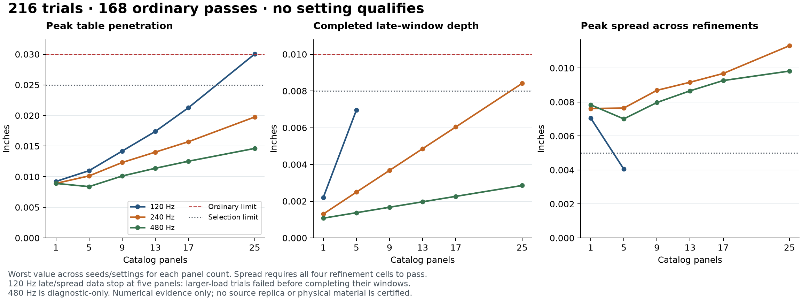

# Independent load-aware contact selection

Continues the active verified-build goal from published checkpoint `a45449201028386df7fb7706161490f31db9f7e5`. The independently reviewed plan is `2026-09-27-loaded-contact-plan.md`. This experiment addresses the source-independent 25-panel table-contact failure; it cannot establish source shape, hidden inventory, physical material values, assembly or car turns.

## Implementation and evidence contracts

The fixture family includes the unchanged flat and five-panel fixtures plus independent nine-, thirteen-, seventeen- and twenty-five-panel catalog shells. Each has distinct panels, valid magnetic edges and no raw overlaps. The new runner uses the predeclared 216 combinations of frequency, integration rate, solver count and seed. It counts actual native integration calls and elapsed time, stops at the first invalid state, solid failure, popped joint, excessive displacement or penetration, and records the terminal bodies and joints. An incomplete late window or rest interval cannot be reported as complete. Atomic per-cell checkpoints permit an explicit resume only with matching input, script and runtime hashes and an ordered matrix prefix.

Selection requires all 216 unique declared cells to be present. For each eligible frequency, every cell must meet the unchanged ordinary criteria and the stricter predeclared penetration margins; all four refinement cells must pass before a sensitivity spread is available. The 480 Hz rows remain diagnostic-only. Static inspection labels interrupted terminal poses as failure states, never settled builds.

## Review and correction

Independent initial code review found two accepted evidence-validation gaps. The assessor checked labels without verifying recorded settings, and did not ensure terminal snapshots retained the complete declared fixture. Both are corrected: actual timestep, solver count, length unit, allowed linear error and readable contact ERP are checked; complete reference panels, dynamic body modes, finite states, connections and active joint models must match the fixture. Rapier's frequency property is setter-only. The recorded effective frequency is explicitly inferred from readable ERP using the unchanged native damping ratio of five, then checked alongside ERP against the requested frequency.

The initial partial sweep was stopped and retained locally, without selection or promotion. A focused positive test caught an attempted read of the setter-only frequency property during correction. That short retry was also stopped. After all eight focused cases passed, a fresh complete sweep started with the corrected runner. The corruption cases include copied flat snapshots labeled as heavier loads, changed numerical settings, missing/duplicate panels or joints, changed catalog shape/anchor, a fixed body and omitted connections. Synthetic selection records are explicitly confined to tests and never written as physical evidence.

Runtime constants, acceptance limits, original source media, observations, published candidate models and physical evidence have not changed in this diagnostic increment. The frozen validator remains `39bf11c647fd7845b96cd8e2748d5c6c388ec2229bdc14cad60be83b3c60c120`. The complete experiment selects no replacement setting.

## Baseline collision event

`inspect-loaded-contact-event.ts` reproduces the predeclared 25-panel, 120 Hz, 960 integration-Hz, 16-solver, seed-0 cell and captures its actual first failure. At native step 112 (0.116666673 simulated seconds), the bottom square (historical fixture ID `roof`, inverted to form the base) crosses the table by 0.030016321 inches. It is the only panel below the table. All 25 bodies are dynamic, the sum of simulated body masses is approximately 0.650 kg, all 48 magnetic joints remain active, and no joint has popped. The final native manifold contains four table contacts with signed distances approximately -0.02998 to -0.02771 inches; the current solid guard records the slightly later failing pose. Native manifolds and current poses are labeled separately.

This localizes an actual table-contact event, not a missing-joint or missing-collider explanation. It does not by itself prove the cause or justify a replacement frequency. The matrix uses the same additive seeded release helper as the existing contact sweep; the earlier standalone `releaseCandidate` diagnostic replaces initial imperfection velocities, so its exact penetration decimals are not expected to match this contact experiment. Both preserve the same catalog masses and acceptance limits. Raw terminal state, body measurements, contacts and code hashes are retained in `diagnostics/2026-09-27-loaded-contact-event.json`.

All 24 original 120 Hz flat/five-panel rows reproduce exactly across peak/late penetration, displacement, final speeds, rest count, popped joints, numerical settings and solid failure fields. The collision-event replay also matches its corresponding matrix trial exactly. These comparisons are retained in `diagnostics/2026-09-27-loaded-contact-baseline-comparison.json`.

## Complete matrix result

All **216** predeclared unique cells completed their diagnostic run: **168 ordinary passes and 48 failures**. Completion of the runner is not a passing contact qualification. No eligible setting meets the stronger predeclared selection criteria.

| Contact frequency | Ordinary passes | First failures | Maximum peak spread across complete refinement groups | Selection |
|---|---:|---|---:|---|
| 120 Hz | 24/72 | 36 late-penetration, 12 table-penetration | 0.007060 in | Rejected |
| 240 Hz | 72/72 | None | 0.011313 in | Rejected; also late depth up to 0.008411 in exceeds 0.008 margin |
| 480 Hz | 72/72 | None | 0.009820 in | Diagnostic-only; also exceeds 0.005 peak-spread limit |

The complete terminal states, first failures, actual time, fixture inputs, settings and hashes are retained losslessly in `diagnostics/2026-09-27-loaded-contact-matrix.json.gz` (33,265,107 bytes uncompressed, 1,107,208 compressed). The adjacent manifest binds the raw and compressed bytes and script versions. `2026-09-27-loaded-contact-inspection.json` provides the directly readable per-cell physical/shape summary. No unsuccessful interval has complete late/rest credit. Both failed and passing rows remain present.

The supplemental plot reads that exact archived matrix and shows worst values across settings/seeds. Incomplete late windows and incomplete refinement groups are omitted, with their absence stated on the figure. Its script and image hashes are in the manifest. This presentation-only addition uses a reduced loop: immutable input digest and complete-count assertions, direct data aggregation, execution and visual inspection. It changes no runtime, source measurement, acceptance decision, deployment configuration or data flow.

Reproduce with `node --import tsx scripts/reference/probe-contact-matrix.ts`, then `node --import tsx scripts/reference/inspect-contact-matrix.ts`. A stopped run can resume with an explicit output path followed by `--resume`; changed input/code hashes reject the checkpoint. The original 72-row flat/five-panel production sweep remains unchanged at 36/72 individual passes and 120 Hz selection within its narrower coverage. It is distinct from this new 216-cell load matrix, whose selection is null.

## Validation

The updated focused suite passes 34 tests across the numerical matrix, original contact and backend-identity suites. Type checking passes. Lint has zero errors and 38 existing warnings. Artifact verification confirms all four published models/reports and the frozen validator are unchanged. Production build passes, and the built workshop passes downloads, actual small/medium assembly motion, numbered joins, partial-source-stage boundaries, missing-snail state and mobile without overflow or browser errors. Medium support release and mobile screenshots were visually inspected. The generated `next-env.d.ts` build edit was restored in this isolated worktree, preserving the original checkout's unrelated changes.

The complete regression suite passes: **677 tests, one existing skip, all 57 files**, in 2099.47 seconds. The validation transcript retains its actual stdout alongside the focused checks. The next finer-rate experiment has independent plan review (`2026-09-27-finer-contact-plan.review.md`); it will not alter the current frozen experiment or runtime. It tests the same independent loads with 240/480 Hz at 1920/3840/7680 integration Hz, allowing only predeclared adjacent refinement pairs and preserving every margin. A setting can change only after that new evidence qualifies it and the remaining physical/source regressions pass.
