# Verification Contact Sheet

Generated: 2026-05-27T22:11:07.686Z

This sheet is generated by `npm run verify:builds`. Each build includes final multi-angle renders and per-step screenshots captured from the running app.

## Jet Aircraft (library)

- Prompt: Jet Aircraft
- UI status: needs repair
- Validation status: error
- Raw overlaps: 58
- Instruction steps: 6 / max tile step 6
- Engine gate: expected-fail
- Gate reasons: pre-filter failed: 58 raw tile overlap(s) exceed 0.03; raw-overlap:front-lower-left<->aircraft-5:0.09; raw-overlap:front-lower-left<->left-nose-side-cheek:0.09; raw-overlap:front-lower-right<->aircraft-6:0.09; raw-overlap:front-lower-right<->right-nose-side-cheek:0.09; raw-overlap:rear-lower-left<->aircraft-5:0.09; raw-overlap:rear-lower-right<->aircraft-6:0.09; raw-overlap:aircraft-5<->left-nose-side-cheek:0.18; raw-overlap:aircraft-5<->left-front-alignment-brace:0.09; pre-filter failed: 47 invalid magnetic connection/support issue(s); invalid-edge:front-lower-left:3->left-nose-side-cheek:0; invalid-edge:front-lower-right:1->right-nose-side-cheek:0; invalid-edge:aircraft-5:1->left-nose-side-cheek:0; invalid-edge:aircraft-6:1->right-nose-side-cheek:0; invalid-edge:front-upper-left:3->left-folded-nose-panel:0; invalid-edge:front-upper-left:2->top-front-fin:0; invalid-edge:front-upper-right:1->right-folded-nose-panel:0; invalid-edge:front-upper-right:2->front-upper-nose-cap:0; invalid-edge:aircraft-11:1->left-folded-nose-panel:0; invalid-edge:aircraft-12:1->right-folded-nose-panel:0; invalid-edge:top-deck-left:0->top-front-fin:0; invalid-edge:top-deck-right:0->front-upper-nose-cap:0
- Harness gate: pass

### final-default


### final-side

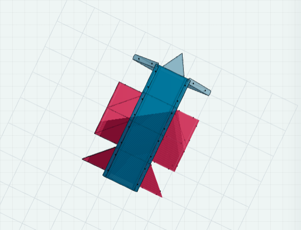

### final-high


### step-01

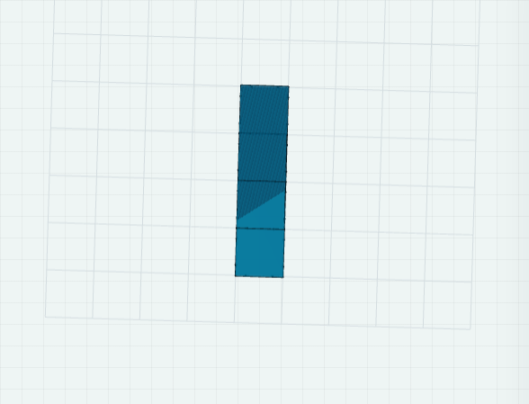

### step-02

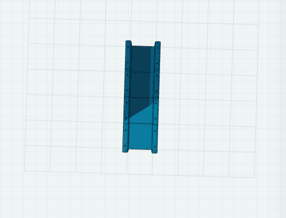

### step-03

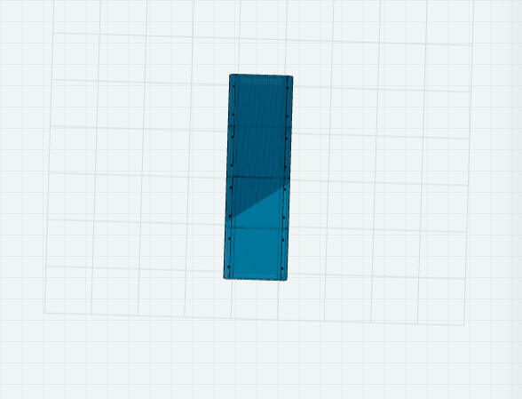

### step-04

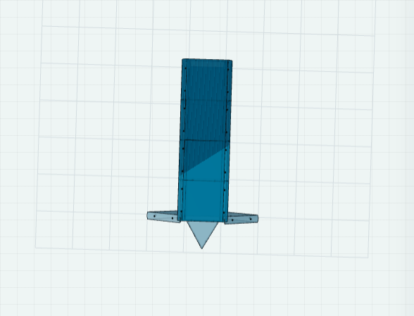

### step-05

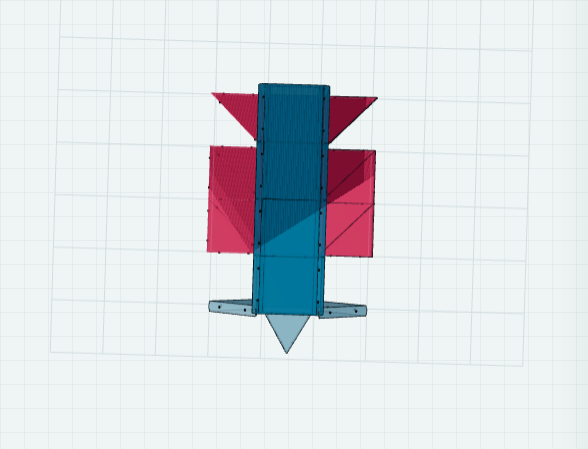

### step-06


<details>
<summary>Instruction text captured during verification</summary>

```text
1. Start with the base
6 tiles
Place 6 tiles on the table to make the front lower fuselage wall and rear lower fuselage wall. Keep the lower edges flat and aligned.
2. Lock in the sides
8 tiles
Attach 8 tiles at right angles as front upper fuselage wall and rear upper fuselage wall. These pieces help the model stand while you keep building.
3. Lock in the sides
6 tiles
Attach 6 tiles at right angles as left pointed nose panel and right pointed nose panel. These pieces help the model stand while you keep building.
4. Attach the wings
8 tiles
Attach 8 tiles as left inner wing panel and right inner wing panel. Mirror the left and right sides so the aircraft stays balanced.
5. Add the fins
6 tiles
Add 6 tiles for the left horizontal tail piece and right horizontal tail piece. Press gently at the contact edge so the fins stay upright.
6. Add the fins
6 tiles
Add 6 tiles for the green top front fin and left top adjustment plate. Press gently at the contact edge so the fins stay upright.
```

</details>

## Small Car Ramp (library)

- Prompt: Small Car Ramp
- UI status: engine verified
- Validation status: pass
- Raw overlaps: 0
- Instruction steps: 4 / max tile step 4
- Engine gate: pass
- Gate reasons: pre-filter passed: no raw tile overlaps; pre-filter passed: 9 valid magnetic joint(s); engine passed: build stands (max displacement 0.078); engine passed: roll test reached the bottom without falling off
- Harness gate: pass

### final-default


### final-side

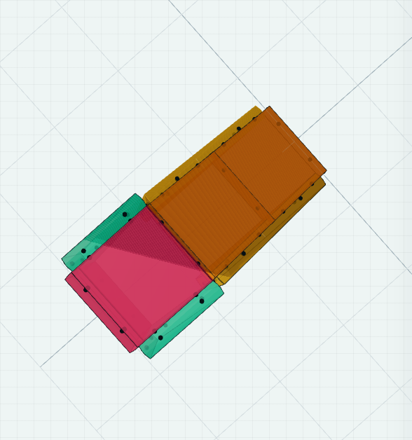

### final-high


### step-01

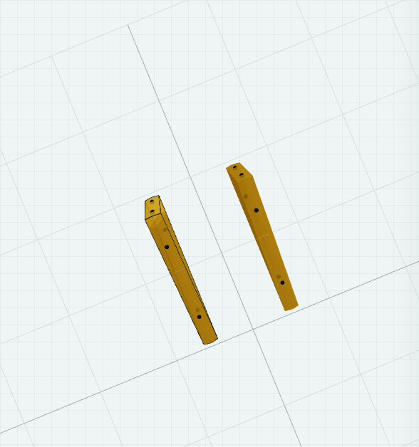

### step-02

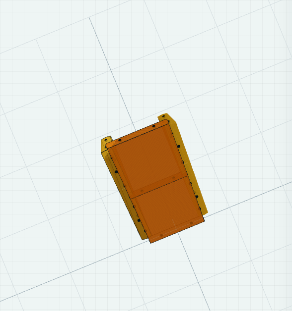

### step-03

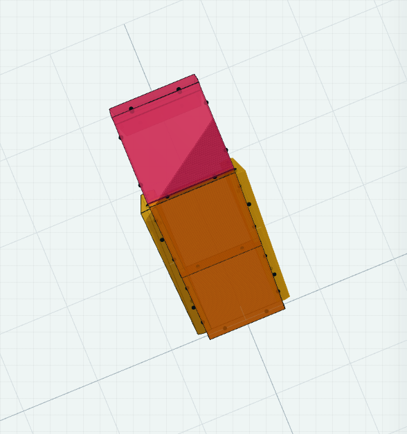

### step-04

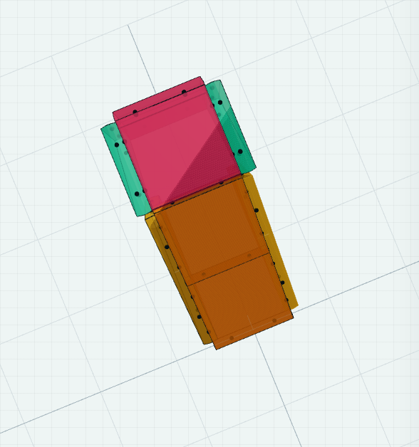

<details>
<summary>Instruction text captured during verification</summary>

```text
1. Start with the base
2 tiles
Place 2 tiles on the table to make the left yellow isosceles wedge side with ground edge and right yellow isosceles wedge side with ground edge. Keep the lower edges flat and aligned.
2. Build the next layer
2 tiles
Attach 2 tiles to form the lower orange sloped driving square and upper orange sloped driving square. Keep the driving surface sloped, with full magnetic edges seated against the support pieces.
3. Build the next layer
2 tiles
Add 2 tiles for the red supported flat top landing square and red vertical support square on right-triangle leg. Match full edges whenever possible so the magnets can grab cleanly.
4. Lock in the sides
2 tiles
Attach 2 tiles at right angles as left green flipped right-triangle side support and right green flipped right-triangle side support. These pieces help the model stand while you keep building.
```

</details>

## Medium Car Ramp (library)

- Prompt: Medium Car Ramp
- UI status: engine verified
- Validation status: pass
- Raw overlaps: 0
- Instruction steps: 4 / max tile step 4
- Engine gate: pass
- Gate reasons: pre-filter passed: no raw tile overlaps; pre-filter passed: 12 valid magnetic joint(s); engine passed: build stands (max displacement 0.424); engine passed: roll test reached the bottom without falling off
- Harness gate: pass

### final-default


### final-side

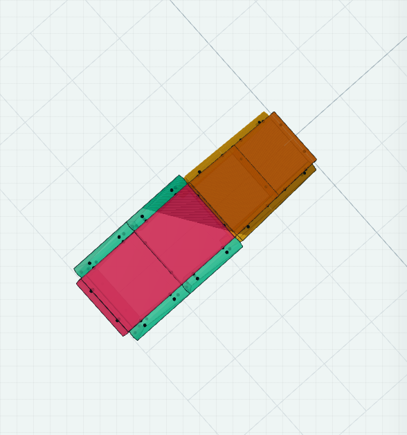

### final-high


### step-01

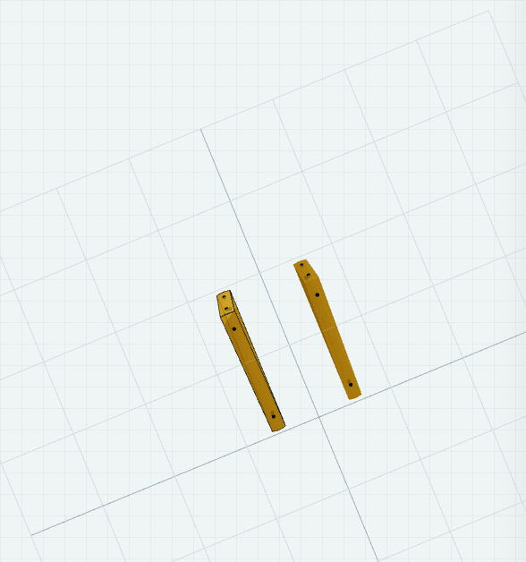

### step-02

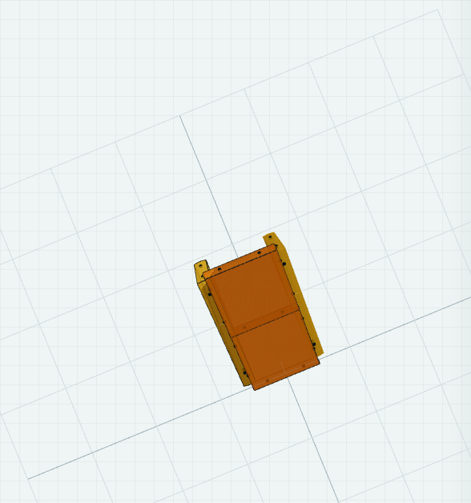

### step-03

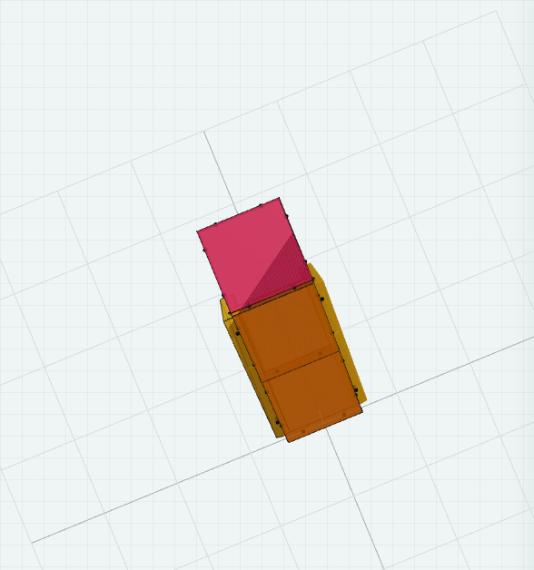

### step-04

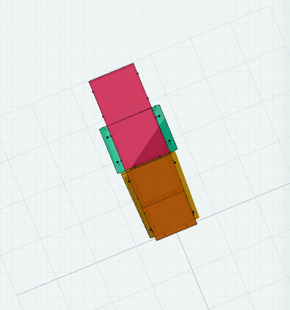

<details>
<summary>Instruction text captured during verification</summary>

```text
1. Start with the base
2 tiles
Place 2 tiles on the table to make the medium left yellow isosceles wedge side with ground edge and medium right yellow isosceles wedge side with ground edge. Keep the lower edges flat and aligned.
2. Build the next layer
3 tiles
Attach 3 tiles to form the medium lower orange sloped driving square and medium upper orange sloped driving square. Keep the driving surface sloped, with full magnetic edges seated against the support pieces.
3. Build the next layer
2 tiles
Add 2 tiles for the medium red supported flat top landing square and medium red vertical support square on right-triangle leg. Match full edges whenever possible so the magnets can grab cleanly.
4. Lock in the sides
4 tiles
Attach 4 tiles to form the medium left green flipped right-triangle side support and medium right green flipped right-triangle side support. Keep the driving surface sloped, with full magnetic edges seated against the support pieces.
```

</details>

## Large Car Ramp (library)

- Prompt: Large Car Ramp
- UI status: needs repair
- Validation status: error
- Raw overlaps: 6
- Instruction steps: 8 / max tile step 8
- Engine gate: expected-fail
- Gate reasons: pre-filter failed: 6 raw tile overlap(s) exceed 0.03; raw-overlap:large-wall-square-1-1<->large-square-1:0.09; raw-overlap:large-wall-square-2-1<->large-square-1:0.09; raw-overlap:large-wall-square-4-1<->large-square-2:0.09; raw-overlap:large-wall-square-5-1<->large-square-2:0.09; raw-overlap:large-wall-square-6-1<->large-square-3:0.09; raw-overlap:large-wall-square-7-1<->large-square-3:0.09; pre-filter passed: 50 valid magnetic joint(s)
- Harness gate: pass

### final-default


### final-side

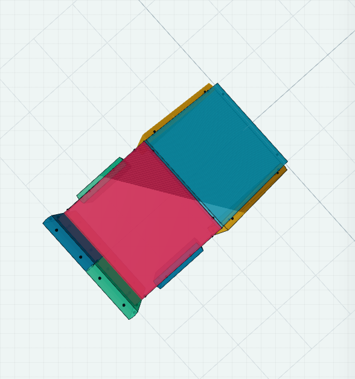

### final-high


### step-01

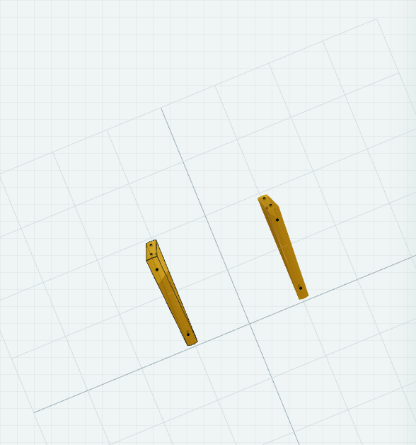

### step-02

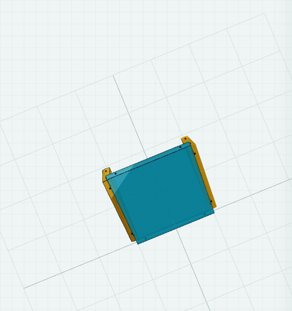

### step-03

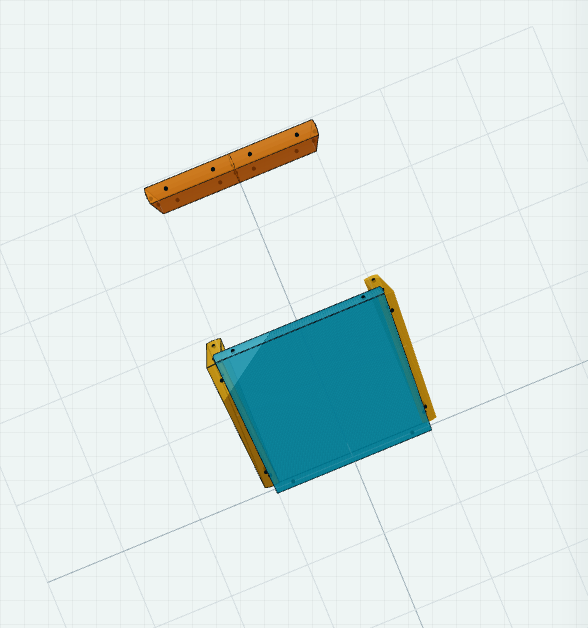

### step-04

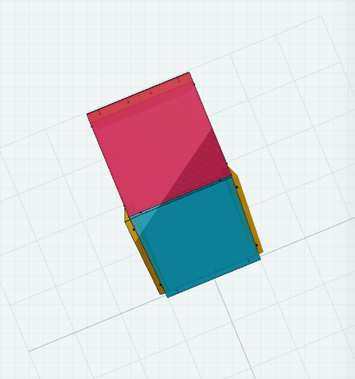

### step-05

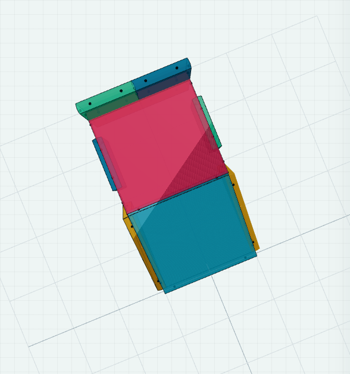

### step-06


### step-07


### step-08


<details>
<summary>Instruction text captured during verification</summary>

```text
1. Start with the base
7 tiles
Place 7 tiles on the table to make the large rear wall square. Keep the lower edges flat and aligned.
2. Build the next layer
7 tiles
Add 7 tiles for the large rear wall square. Match full edges whenever possible so the magnets can grab cleanly.
3. Build the next layer
7 tiles
Add 7 tiles for the large rear wall square. Match full edges whenever possible so the magnets can grab cleanly.
4. Build the next layer
7 tiles
Add 7 tiles for the large rear wall square. Match full edges whenever possible so the magnets can grab cleanly.
5. Build the next layer
7 tiles
Add 7 tiles for the large rear wall square. Match full edges whenever possible so the magnets can grab cleanly.
6. Build the next layer
7 tiles
Add 7 tiles for the large rear wall square. Match full edges whenever possible so the magnets can grab cleanly.
7. Shape the ramp
3 tiles
Attach 3 tiles to form the XL ramp plane. Keep the driving surface sloped, with full magnetic edges seated against the support pieces.
8. Shape the ramp
6 tiles
Attach 6 tiles to form the large ramp triangular side marker. Keep the driving surface sloped, with full magnetic edges seated against the support pieces.
```

</details>

## Jet Aircraft (prompt)

- Prompt: Jet Aircraft
- UI status: magnet checks pass
- Validation status: pass
- Raw overlaps: 0
- Instruction steps: 7 / max tile step 7
- Engine gate: expected-fail
- Gate reasons: pre-filter passed: no raw tile overlaps; pre-filter passed: 39 valid magnetic joint(s); engine failed: build does not stand (max displacement 2.460)
- Harness gate: pass

### final-default


### final-side

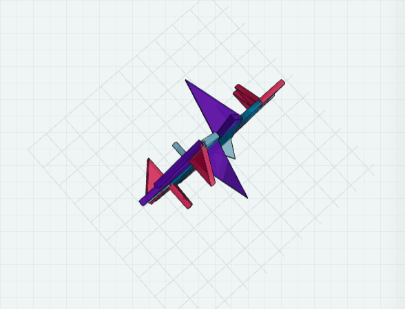

### final-high


### step-01

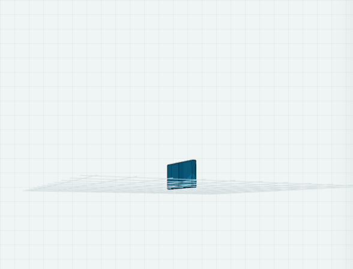

### step-02


### step-03


### step-04


### step-05

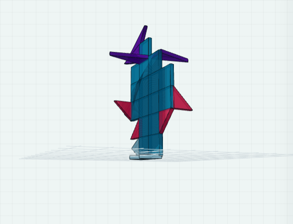

### step-06


### step-07


<details>
<summary>Instruction text captured during verification</summary>

```text
1. Build the fuselage
2 tiles
Attach 2 tiles: jet fuselage body square. Keep the two-column body straight so later wing and tail edges stay mirrored.
2. Build the fuselage
2 tiles
Attach 2 tiles: jet fuselage body square. Keep the two-column body straight so later wing and tail edges stay mirrored.
3. Shape the wings
6 tiles
Attach 6 tiles: jet fuselage body square and jet wing and tail square. Mirror left and right pieces across the fuselage and press only along seated magnet edges.
4. Shape the wings
4 tiles
Attach 4 tiles: jet fuselage body square and jet wing and tail square. Mirror left and right pieces across the fuselage and press only along seated magnet edges.
5. Shape the wings
14 tiles
Attach 14 tiles: jet fuselage body square, jet pointed nose and wing triangle, jet folded wing brace, and jet vertical tail fin. Mirror left and right pieces across the fuselage and press only along seated magnet edges.
6. Shape the wings
9 tiles
Attach 9 tiles: jet pointed nose and wing triangle, jet folded wing brace, and jet vertical tail fin. Mirror left and right pieces across the fuselage and press only along seated magnet edges.
7. Shape the wings
3 tiles
Attach 3 tiles: jet pointed nose and wing triangle and jet folded wing brace. Mirror left and right pieces across the fuselage and press only along seated magnet edges.
```

</details>

## Jet Aircraft (prompt)

- Prompt: build me a jet aircraft
- UI status: magnet checks pass
- Validation status: pass
- Raw overlaps: 0
- Instruction steps: 7 / max tile step 7
- Engine gate: expected-fail
- Gate reasons: pre-filter passed: no raw tile overlaps; pre-filter passed: 39 valid magnetic joint(s); engine failed: build does not stand (max displacement 2.460)
- Harness gate: pass

### final-default

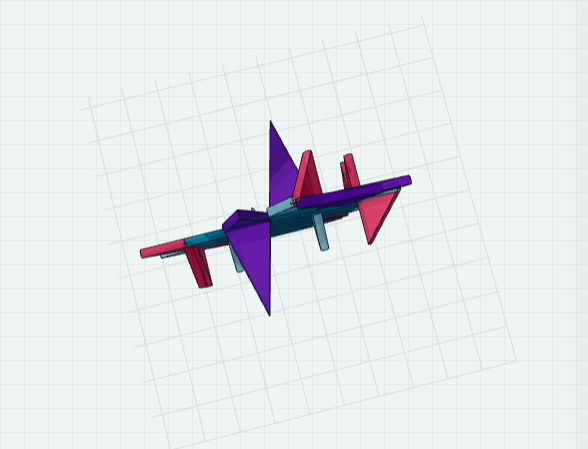

### final-side


### final-high


### step-01


### step-02

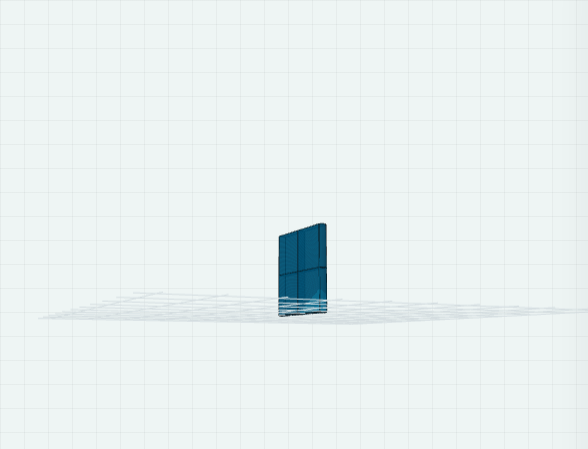

### step-03


### step-04


### step-05


### step-06


### step-07


<details>
<summary>Instruction text captured during verification</summary>

```text
1. Build the fuselage
2 tiles
Attach 2 tiles: jet fuselage body square. Keep the two-column body straight so later wing and tail edges stay mirrored.
2. Build the fuselage
2 tiles
Attach 2 tiles: jet fuselage body square. Keep the two-column body straight so later wing and tail edges stay mirrored.
3. Shape the wings
6 tiles
Attach 6 tiles: jet fuselage body square and jet wing and tail square. Mirror left and right pieces across the fuselage and press only along seated magnet edges.
4. Shape the wings
4 tiles
Attach 4 tiles: jet fuselage body square and jet wing and tail square. Mirror left and right pieces across the fuselage and press only along seated magnet edges.
5. Shape the wings
14 tiles
Attach 14 tiles: jet fuselage body square, jet pointed nose and wing triangle, jet folded wing brace, and jet vertical tail fin. Mirror left and right pieces across the fuselage and press only along seated magnet edges.
6. Shape the wings
9 tiles
Attach 9 tiles: jet pointed nose and wing triangle, jet folded wing brace, and jet vertical tail fin. Mirror left and right pieces across the fuselage and press only along seated magnet edges.
7. Shape the wings
3 tiles
Attach 3 tiles: jet pointed nose and wing triangle and jet folded wing brace. Mirror left and right pieces across the fuselage and press only along seated magnet edges.
```

</details>

## Jet Aircraft (prompt)

- Prompt: fast airplane with wings
- UI status: magnet checks pass
- Validation status: pass
- Raw overlaps: 0
- Instruction steps: 7 / max tile step 7
- Engine gate: expected-fail
- Gate reasons: pre-filter passed: no raw tile overlaps; pre-filter passed: 39 valid magnetic joint(s); engine failed: build does not stand (max displacement 2.460)
- Harness gate: pass

### final-default


### final-side


### final-high

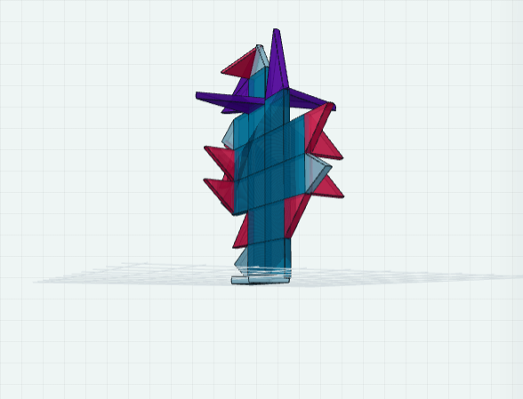

### step-01


### step-02


### step-03

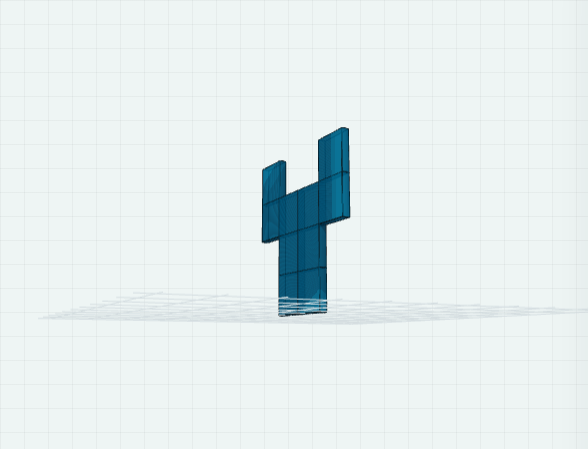

### step-04

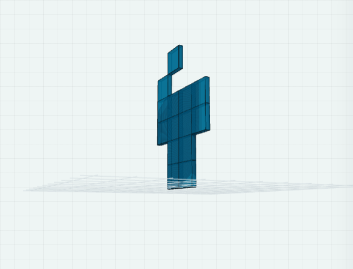

### step-05


### step-06

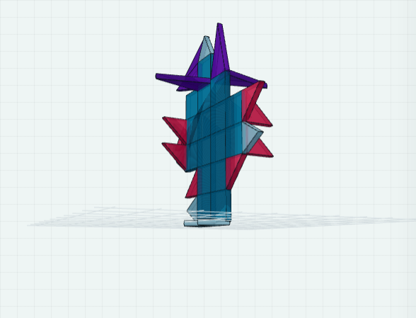

### step-07


<details>
<summary>Instruction text captured during verification</summary>

```text
1. Build the fuselage
2 tiles
Attach 2 tiles: jet fuselage body square. Keep the two-column body straight so later wing and tail edges stay mirrored.
2. Build the fuselage
2 tiles
Attach 2 tiles: jet fuselage body square. Keep the two-column body straight so later wing and tail edges stay mirrored.
3. Shape the wings
6 tiles
Attach 6 tiles: jet fuselage body square and jet wing and tail square. Mirror left and right pieces across the fuselage and press only along seated magnet edges.
4. Shape the wings
4 tiles
Attach 4 tiles: jet fuselage body square and jet wing and tail square. Mirror left and right pieces across the fuselage and press only along seated magnet edges.
5. Shape the wings
14 tiles
Attach 14 tiles: jet fuselage body square, jet pointed nose and wing triangle, jet folded wing brace, and jet vertical tail fin. Mirror left and right pieces across the fuselage and press only along seated magnet edges.
6. Shape the wings
9 tiles
Attach 9 tiles: jet pointed nose and wing triangle, jet folded wing brace, and jet vertical tail fin. Mirror left and right pieces across the fuselage and press only along seated magnet edges.
7. Shape the wings
3 tiles
Attach 3 tiles: jet pointed nose and wing triangle and jet folded wing brace. Mirror left and right pieces across the fuselage and press only along seated magnet edges.
```

</details>

## Small Car Ramp (prompt)

- Prompt: Small Car Ramp
- UI status: magnet checks pass
- Validation status: pass
- Raw overlaps: 0
- Instruction steps: 3 / max tile step 3
- Engine gate: expected-fail
- Gate reasons: pre-filter passed: no raw tile overlaps; pre-filter failed: 2 invalid magnetic connection/support issue(s); invalid-edge:lower-sloped-driving-panel:0->lower-runout-panel:0; disconnected-tile:lower-runout-panel
- Harness gate: pass

### final-default

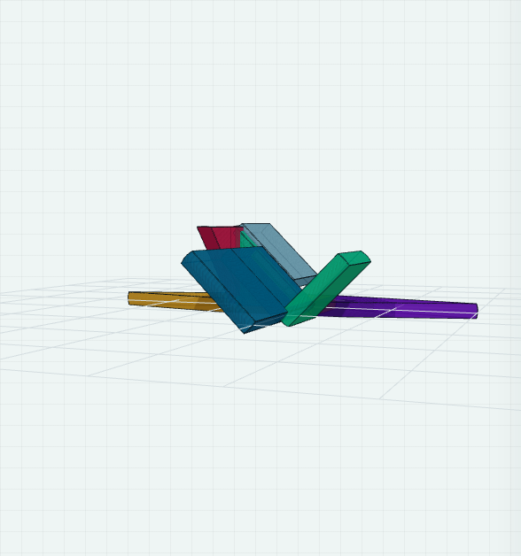

### final-side

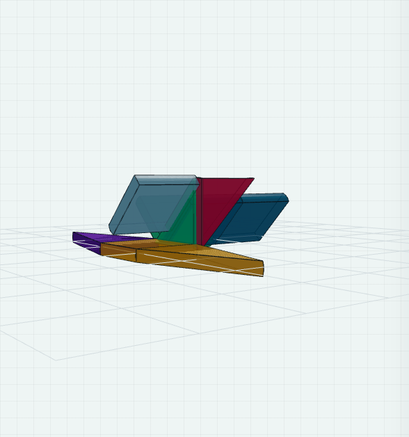

### final-high

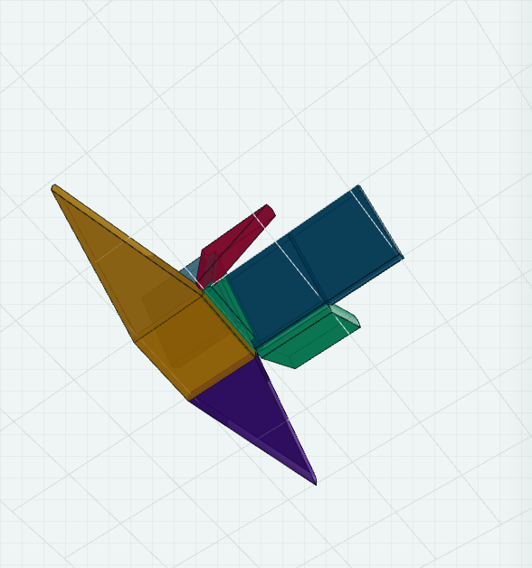

### step-01

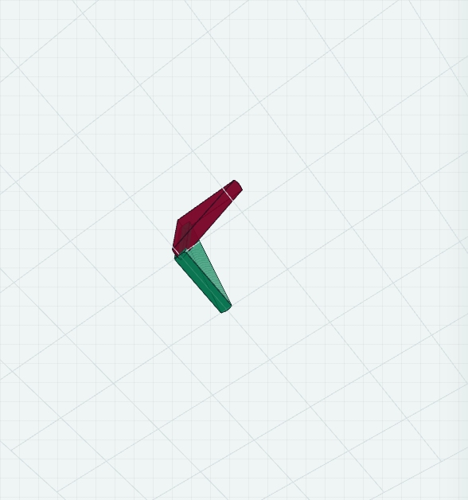

### step-02

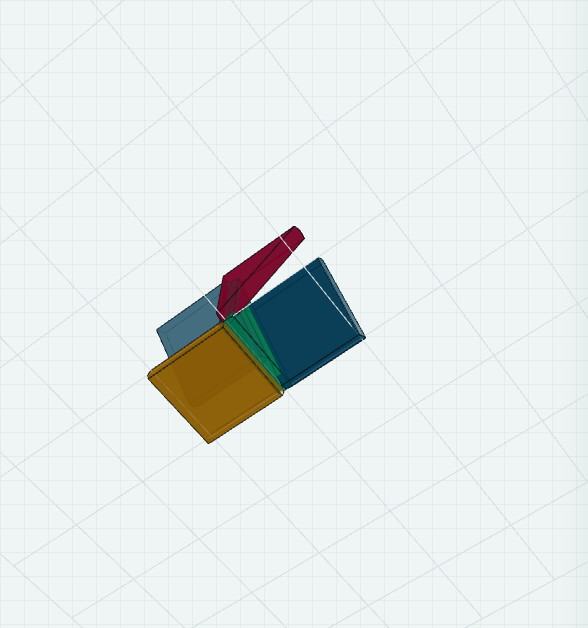

### step-03

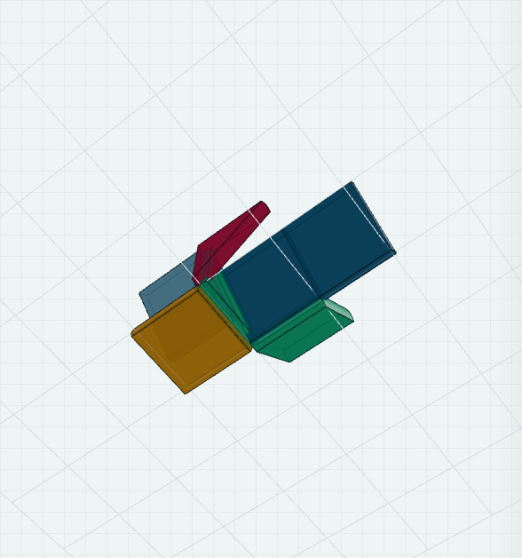

<details>
<summary>Instruction text captured during verification</summary>

```text
1. Make the wedge sides
3 tiles
Stand the two right triangles opposite each other to set the ramp angle. Keep their long edges aligned so the driving surface has a clean slope.
2. Add the driving surface
5 tiles
Snap on the sloped driving panel, the short lower runout, and the top landing panel. The car should have a smooth path from table to landing.
3. Lock the supports
1 tiles
Add the front and rear support squares underneath the slope. Press along the full magnet edges so the wedge does not spread open.
```

</details>

## Medium Car Ramp (prompt)

- Prompt: Medium Car Ramp
- UI status: magnet checks pass
- Validation status: pass
- Raw overlaps: 0
- Instruction steps: 7 / max tile step 7
- Engine gate: expected-fail
- Gate reasons: pre-filter passed: no raw tile overlaps; pre-filter passed: 36 valid magnetic joint(s); engine failed: build does not stand (max displacement 2.404)
- Harness gate: pass

### final-default


### final-side

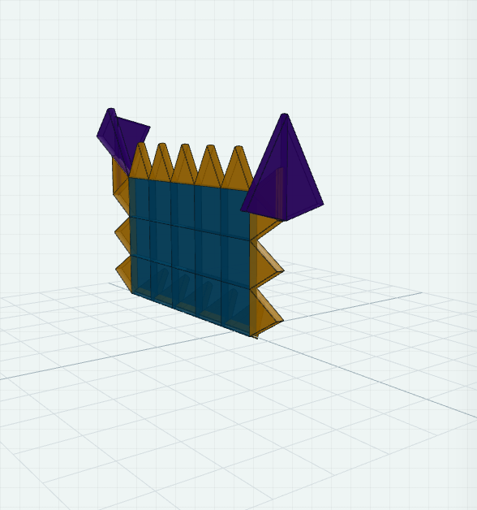

### final-high


### step-01


### step-02

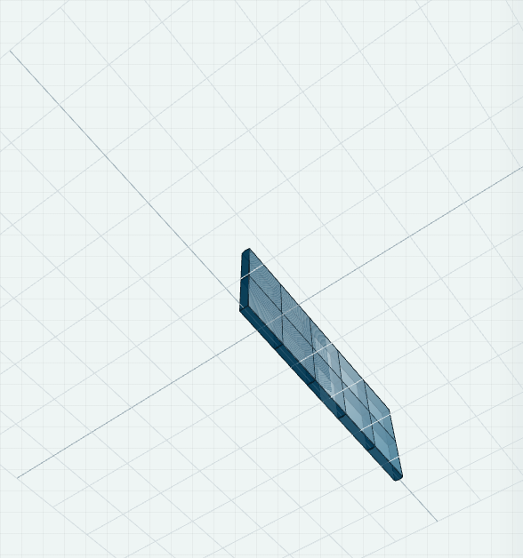

### step-03

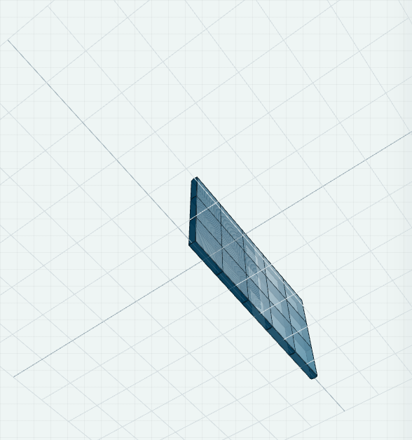

### step-04

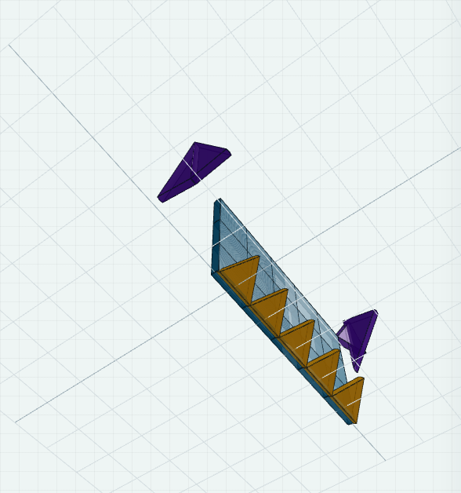

### step-05

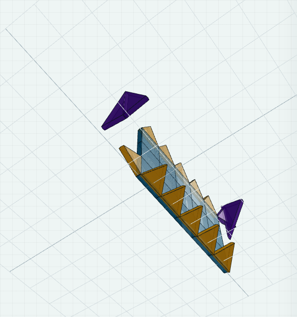

### step-06


### step-07


<details>
<summary>Instruction text captured during verification</summary>

```text
1. Start the rear wall
5 tiles
Build the first row of the rear support wall from five squares. Keep it straight; the slope will reference this row.
2. Raise the wall
5 tiles
Add the second row of five squares directly above the first. Check that the panel stays flat and the side edges remain even.
3. Finish the support grid
5 tiles
Add the third row of five squares to complete the tall rear support. This gives the medium ramp its higher landing.
4. Brace the lower slope
9 tiles
Add the first triangle pattern along the lower slope and side guards. These pieces begin converting the wall into a ramp.
5. Continue the triangle run
6 tiles
Snap on the next set of equilateral triangles along the driving surface. Keep their edges seated so the incline reads as one continuous path.
6. Finish and test the ramp
6 tiles
Add the final equilateral triangles, then gently press the side braces and roll a small car over the path to check alignment.
7. Shape the ramp
1 tiles
Attach 1 tile to form the medium ramp triangular brace. Keep the driving surface sloped, with full magnetic edges seated against the support pieces.
```

</details>

## Large Car Ramp (prompt)

- Prompt: Large Car Ramp
- UI status: magnet checks pass
- Validation status: pass
- Raw overlaps: 0
- Instruction steps: 8 / max tile step 8
- Engine gate: expected-fail
- Gate reasons: pre-filter passed: no raw tile overlaps; pre-filter passed: 50 valid magnetic joint(s); engine failed: build does not stand (max displacement 2.361)
- Harness gate: pass

### final-default

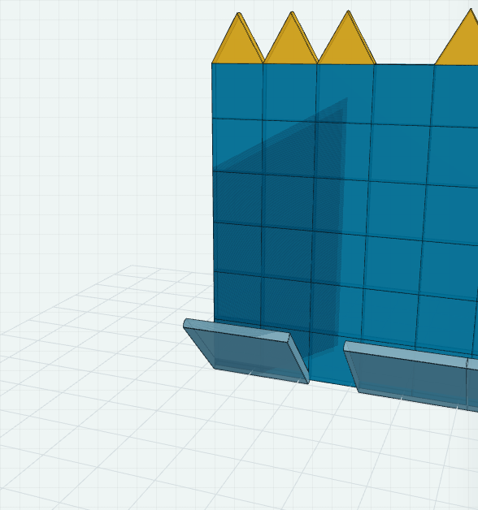

### final-side

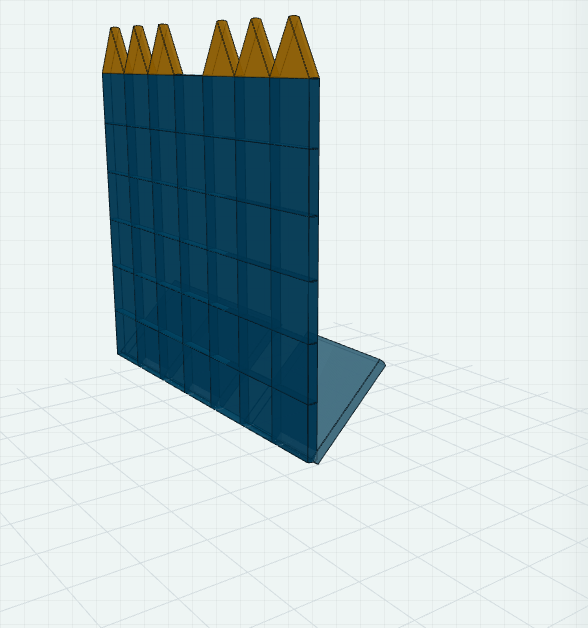

### final-high


### step-01

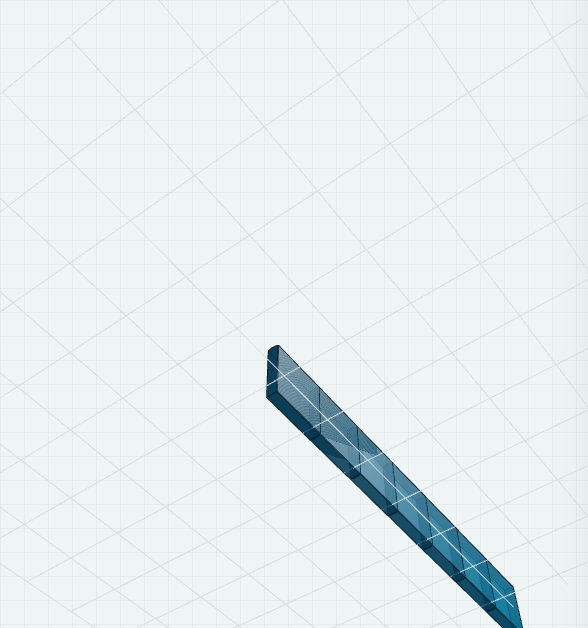

### step-02

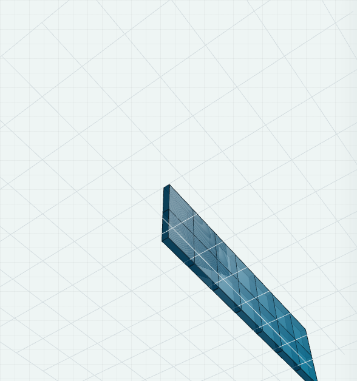

### step-03

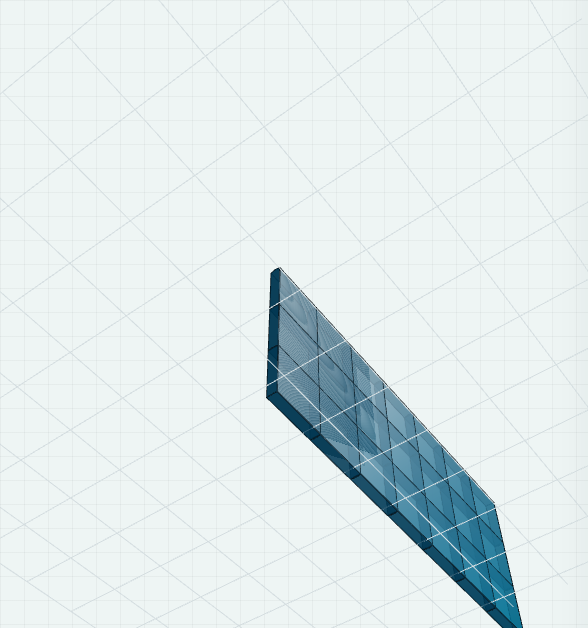

### step-04

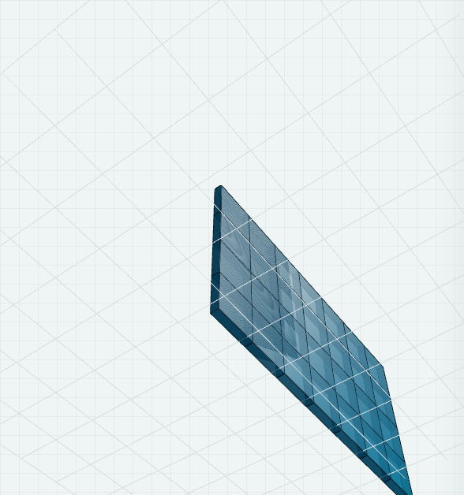

### step-05

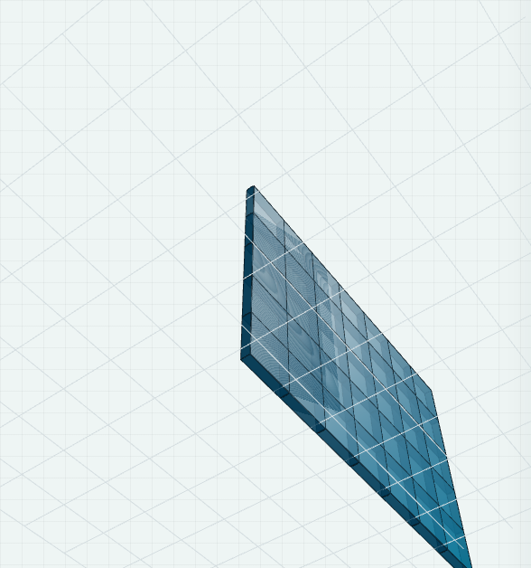

### step-06

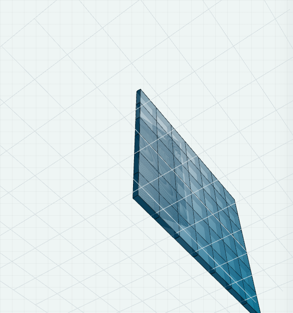

### step-07


### step-08

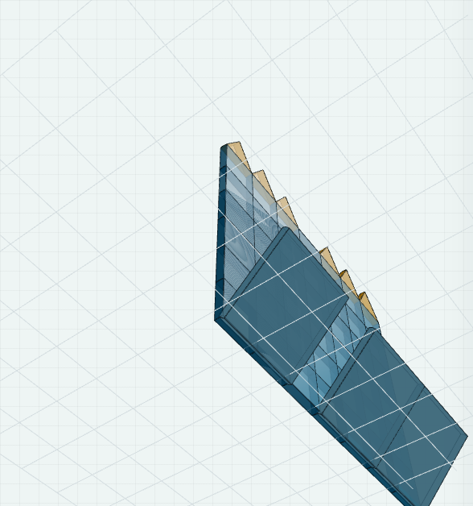

<details>
<summary>Instruction text captured during verification</summary>

```text
1. Begin the tall wall
7 tiles
Lay out the first row of seven squares for the rear wall. This wide base keeps the large ramp from twisting.
2. Add wall row two
7 tiles
Stack the second row of seven squares on top of the base row. Align every vertical seam before continuing.
3. Add wall row three
7 tiles
Build the third row across the full width. Press from the center outward so the wall stays flat.
4. Add wall row four
7 tiles
Continue with the fourth row, keeping the panel upright and square.
5. Add wall row five
7 tiles
Add the fifth row of squares. The wall should now feel like a single rigid panel.
6. Finish the rear wall
7 tiles
Add the sixth row and check the full wall for straight edges before attaching the ramp planes.
7. Attach the large ramp planes
3 tiles
Connect the three large square panels across the lower edge of the wall. Center each panel on the square grid so the slope is broad and even.
8. Add side markers
6 tiles
Place the six equilateral triangles along the upper side edges as markers and braces. Check the car path from bottom to top.
```

</details>

## Medium Car Ramp (prompt)

- Prompt: toy car ramp
- UI status: magnet checks pass
- Validation status: pass
- Raw overlaps: 0
- Instruction steps: 7 / max tile step 7
- Engine gate: expected-fail
- Gate reasons: pre-filter passed: no raw tile overlaps; pre-filter passed: 36 valid magnetic joint(s); engine failed: build does not stand (max displacement 2.404)
- Harness gate: pass

### final-default

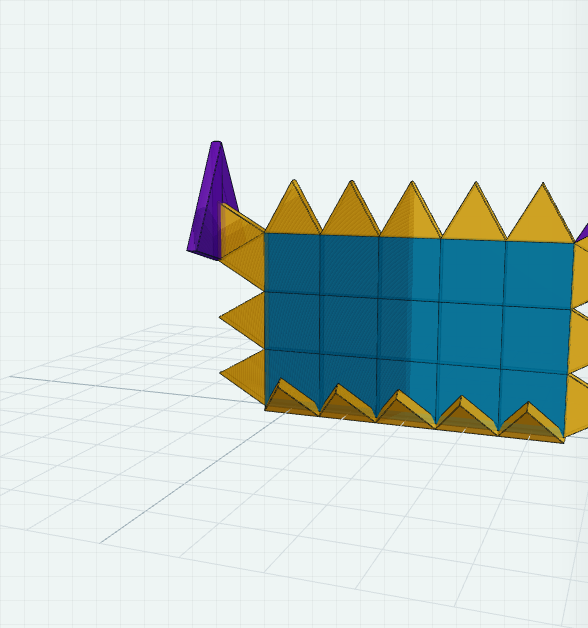

### final-side


### final-high


### step-01

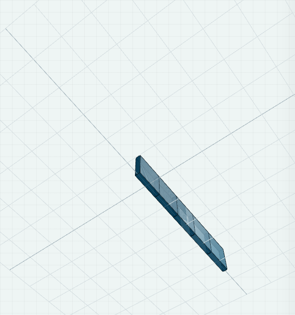

### step-02


### step-03


### step-04


### step-05


### step-06


### step-07


<details>
<summary>Instruction text captured during verification</summary>

```text
1. Start the rear wall
5 tiles
Build the first row of the rear support wall from five squares. Keep it straight; the slope will reference this row.
2. Raise the wall
5 tiles
Add the second row of five squares directly above the first. Check that the panel stays flat and the side edges remain even.
3. Finish the support grid
5 tiles
Add the third row of five squares to complete the tall rear support. This gives the medium ramp its higher landing.
4. Brace the lower slope
9 tiles
Add the first triangle pattern along the lower slope and side guards. These pieces begin converting the wall into a ramp.
5. Continue the triangle run
6 tiles
Snap on the next set of equilateral triangles along the driving surface. Keep their edges seated so the incline reads as one continuous path.
6. Finish and test the ramp
6 tiles
Add the final equilateral triangles, then gently press the side braces and roll a small car over the path to check alignment.
7. Shape the ramp
1 tiles
Attach 1 tile to form the medium ramp triangular brace. Keep the driving surface sloped, with full magnetic edges seated against the support pieces.
```

</details>

## Medium Car Ramp (prompt)

- Prompt: ramp for toy cars
- UI status: magnet checks pass
- Validation status: pass
- Raw overlaps: 0
- Instruction steps: 7 / max tile step 7
- Engine gate: expected-fail
- Gate reasons: pre-filter passed: no raw tile overlaps; pre-filter passed: 36 valid magnetic joint(s); engine failed: build does not stand (max displacement 2.404)
- Harness gate: pass

### final-default


### final-side


### final-high

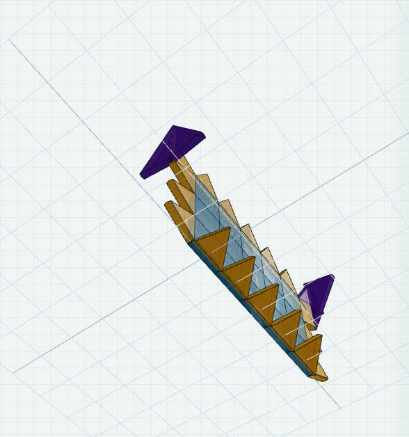

### step-01


### step-02


### step-03


### step-04


### step-05


### step-06


### step-07


<details>
<summary>Instruction text captured during verification</summary>

```text
1. Start the rear wall
5 tiles
Build the first row of the rear support wall from five squares. Keep it straight; the slope will reference this row.
2. Raise the wall
5 tiles
Add the second row of five squares directly above the first. Check that the panel stays flat and the side edges remain even.
3. Finish the support grid
5 tiles
Add the third row of five squares to complete the tall rear support. This gives the medium ramp its higher landing.
4. Brace the lower slope
9 tiles
Add the first triangle pattern along the lower slope and side guards. These pieces begin converting the wall into a ramp.
5. Continue the triangle run
6 tiles
Snap on the next set of equilateral triangles along the driving surface. Keep their edges seated so the incline reads as one continuous path.
6. Finish and test the ramp
6 tiles
Add the final equilateral triangles, then gently press the side braces and roll a small car over the path to check alignment.
7. Shape the ramp
1 tiles
Attach 1 tile to form the medium ramp triangular brace. Keep the driving surface sloped, with full magnetic edges seated against the support pieces.
```

</details>

